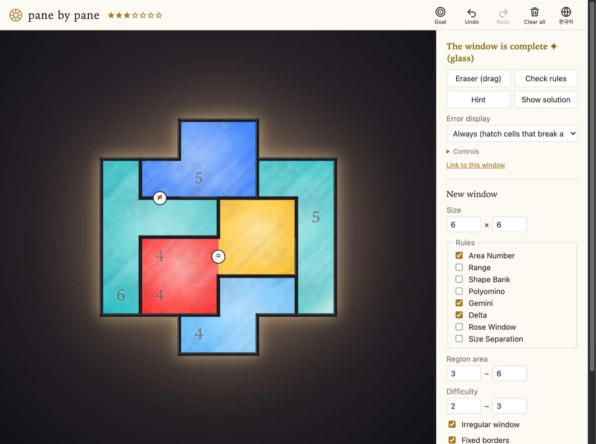

# pane by pane

A stained-glass region-partition puzzle in the spirit of *The Artisan of Glimmith*: a puzzle **engine** (generator, logical solver, uniqueness check, difficulty rating) and a small touch-first **player**, written in TypeScript with no runtime dependencies.

**Play it: <https://kairess.github.io/pane-by-pane/>** · Korean documentation: [README.ko.md](README.ko.md)



## What it does

- **Eight rules**, using the original game's vocabulary in Korean and English: Area Number, Range (Precision / Minimum / Maximum), Shape Bank, Polyomino, Gemini, Delta, Rose Window (Solitude with one symbol) and Size Separation, plus pre-drawn borders and irregular window outlines.
- **Solution-first generation.** A partition is grown (or tiled from a shape catalogue), every true clue is derived, and clues are removed one by one while the puzzle stays uniquely and *logically* solvable. Rules that cannot outline regions by themselves (Range, Solitude) fall back to the original's approach: the pre-drawn borders become the clue and are minimised the same way.
- **A tiered logical solver** (bounds propagation, forced exits, reachability, shape placement, short what-ifs) that doubles as the difficulty rating: one to seven stars from the techniques a human needs, not from search effort.
- **Hints from the player's point of view.** Each hint first points at a region, then explains one deduction in plain language ("the region with the number 5 can only grow through this cell"). Wrong marks are pointed out before anything else.
- **Rule checks that never peek at the solution.** Hatching marks only cells and borders that break a rule outright, so pressing "check" cannot be used as an oracle.
- **A window that lights up.** Regions are panes of glass, borders are lead came. Finish the window and the glass deepens, the room darkens, and light plays across the panes.
- **The goal stays in view.** A strip of chips above the window sums up every rule of the puzzle ("area 3–6", the shape bank, "= same shape"); tap one for the full description. A one-time note on first visit points it out.
- **It ticks.** Every pane painted or erased plays a haptic tick, on Android through the Vibration API and on iOS through the one thing that still works there: a real, invisible `<input type=checkbox switch>` under the finger, moved around during a stroke so that WebKit's own drag-tracking haptic fires once per pane (see `src/web/haptics.ts`).
- **Playable anywhere.** Touch and mouse gestures, undo/redo, autosave, shareable links, Korean or English chosen from the browser and switchable in the header.

## Try it

```sh
npm install
npm run dev        # http://localhost:5173
npm test           # node --test
npm run build      # static site in dist/
```

The generator is also a command-line tool:

```sh
node src/cli.ts gen   --size 6 --rules areaNumber,gemini,delta --stars 2-3 --count 3 --seed 1
node src/cli.ts gen   --size 6 --rules rose --rose 3 --mask --walls
node src/cli.ts batch --size 6 --rules areaNumber,range --count 30       # difficulty distribution
node src/cli.ts gen   ... --json out.json && node src/cli.ts solve out.json
```

Node 22.18+ runs the TypeScript directly; there is no build step for the engine.

## Using the engine

```ts
import { generate } from './src/engine/generator/generate.ts';
import { solveLogically } from './src/engine/logical.ts';

const { puzzle, solution, analysis } = generate({ width: 6, height: 6, rules: ['areaNumber', 'gemini'], stars: [2, 4] })!;
console.log(analysis.stars, solveLogically(puzzle).steps);
```

A puzzle is plain JSON: width, height, optional holes and pre-drawn borders, and a list of clues. Every rule is a clue, so new rules plug in as one class with `init` / `propagate` / `check`. The format and internals are described in [README.ko.md](README.ko.md) and [docs/](docs/).

## Deploying

Pushing to `main` runs `.github/workflows/pages.yml`, which tests, builds and publishes `dist/` to GitHub Pages. Enable Pages with "GitHub Actions" as the source in the repository settings. The site uses relative paths and hash-based URLs, so it works from any sub-path.

## Status

Everything here is a study of the puzzle form: how far generation, hints and rating can be pushed for this family of rules. Ideas, corrections and puzzle-design conversations are welcome in the issues.
